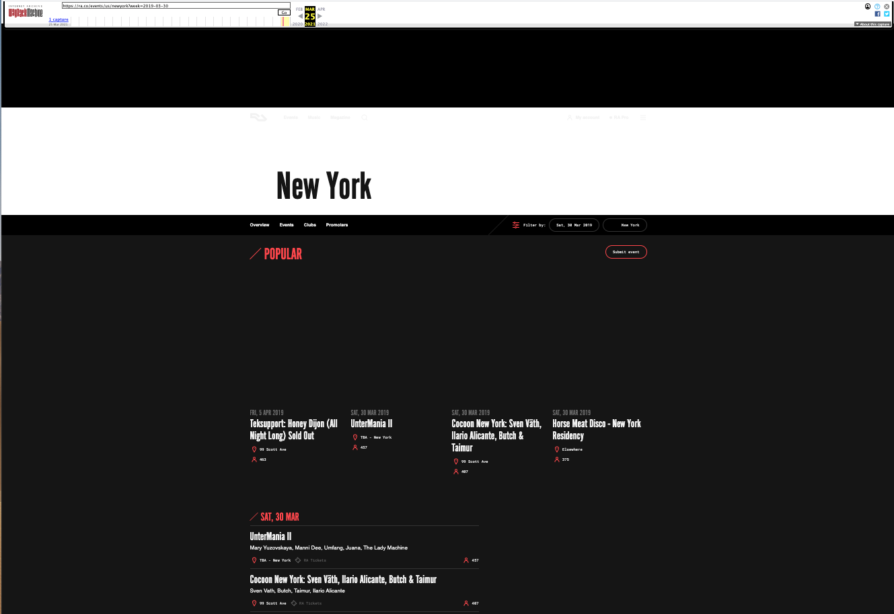
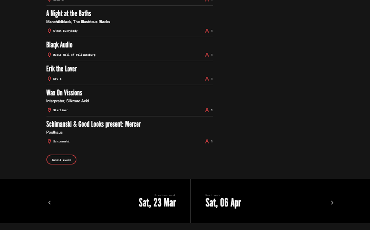

# Scraping Concerts - Lab

## Introduction

Now that you've seen how to scrape a simple website, it's time to again practice those skills on a full-fledged site!

In this lab, you'll practice your scraping skills on an online music magazine and events website called Resident Advisor.

## Objectives

You will be able to:

* Create a full scraping pipeline that involves traversing over many pages of a website, dealing with errors and storing data

## View the Website

For this lab, you'll be scraping the https://ra.co website. For reproducibility we will use the [Internet Archive](https://archive.org/) Wayback Machine to retrieve a version of this page from March 2019.

Start by navigating to the events page [here](https://web.archive.org/web/20210325230938/https://ra.co/events/us/newyork?week=2019-03-30) in your browser. It should look something like this:



## Open the Inspect Element Feature

Next, open the inspect element feature from your web browser in order to preview the underlying HTML associated with the page.

## Write a Function to Scrape all of the Events on the Given Page

The function should return a Pandas DataFrame with columns for the `Event_Name`, `Venue`, and `Number_of_Attendees`.

Start by importing the relevant libraries, making a request to the relevant URL, and exploring the contents of the response with `BeautifulSoup`. Then fill in the `scrape_events` function with the relevant code.


```python
# Relevant imports
```


```python
# __SOLUTION__
# Relevant imports
import requests
from bs4 import BeautifulSoup
import numpy as np
import pandas as pd
import time
```


```python
EVENTS_PAGE_URL = "https://web.archive.org/web/20210326225933/https://ra.co/events/us/newyork?week=2019-03-30"

# Exploration: making the request and parsing the response

```


```python
# __SOLUTION__

EVENTS_PAGE_URL = "https://web.archive.org/web/20210326225933/https://ra.co/events/us/newyork?week=2019-03-30"

# Exploration: making the request and parsing the response
response = requests.get(EVENTS_PAGE_URL)
soup = BeautifulSoup(response.content, "html.parser")
```


```python
# Find the container with event listings in it
# Some hints are giving along the way

# This page is organized somewhat unusually, and many of
# the CSS attributes seem auto-generated. We notice that
# there is a div with "events-all" in its attributes that
# looks promising if we use soup.find(), call this events_all_div

events_all_div = None

# The actual content is nested in a ul containing a single
# li within that div. Unclear why they are using a "list"
# concept for one element, but let's go ahead and select it
# Call this event_listings and use it to find ul and li in 
# events_all_div

event_listings = None


# Print out some chunks of the text inside to make sure we
# have everything we need in here
# For example print the events for March 30th and 31st

```


```python
# __SOLUTION__

# Find the container with event listings in it

# This page is organized somewhat unusually, and many of
# the CSS attributes seem auto-generated. We notice that
# there is a div with "events-all" in its attributes that
# looks promising
events_all_div = soup.find('div', attrs={"data-tracking-id": "events-all"})

# The actual content is nested in a ul containing a single
# li within that div. Unclear why they are using a "list"
# concept for one element, but let's go ahead and select it
event_listings = events_all_div.find("ul").find("li")

# Print out some chunks of the text inside to make sure we
# have everything we need in here

# Beginning has events for March 30th
print(event_listings.text[:200])
print()
# Later we have events for March 31st
march_31st_start = event_listings.text.find("Sun, 31 Mar")
print(event_listings.text[march_31st_start:march_31st_start + 200])

# It looks like everything we need will be inside this event_listings tag
```

    ̸Sat, 30 MarUnterMania IIMary Yuzovskaya, Manni Dee, Umfang, Juana, The Lady MachineTBA - New YorkRARA Tickets457Cocoon New York: Sven Väth, Ilario Alicante, Butch & TaimurSven Vath, Butch, Taimur, Il
    
    Sun, 31 MarSunday: Soul SummitNowadaysRARA Tickets132New Dad & Aaron Clark (Honcho)Aaron Clark, New DadAce Hotel3ParadiscoOccupy The DiscoLe Bain3Sunday Soiree: Unknown Showcase (Detroit)Ryan Dahl, Ha


```python
# Find a list of events by date within that container

# Now we look at what is inside of that event_listings li tag.
# Based on looking at the HTML with developer tools, we see
# that there are 13 children of that tag, all divs. Each div
# is either a container of events on a given date, or empty

# Let's create a collection of those divs. recursive=False
# means we stop at 1 level below the event_listings li
dates = event_listings.findChildren(recursive=False)

# Now let's print out the start of the March 30th and March
# 31st sections again. This time each is in its own "date"
# container

# March 30th is at the 0 index
print("0 index:", dates[0].text[:200])
print()
# The 1 index is empty. We'll need to skip this later
print("1 index: ", dates[1].text)
print()
# March 31st is at the 2 index
print("2 index:", dates[2].text[:200])

# Now we know we can loop over all of the items in the dates
# list of divs to find the dates, although some will be blank
# so we'll need to skip them
```


```python
# __SOLUTION__

# Find a list of events by date within that container

# Now we look at what is inside of that event_listings li tag.
# Based on looking at the HTML with developer tools, we see
# that there are 13 children of that tag, all divs. Each div
# is either a container of events on a given date, or empty

# Let's create a collection of those divs. recursive=False
# means we stop at 1 level below the event_listings li
dates = event_listings.findChildren(recursive=False)

# Now let's print out the start of the March 30th and March
# 31st sections again. This time each is in its own "date"
# container

# March 30th is at the 0 index
print("0 index:", dates[0].text[:200])
print()
# The 1 index is empty. We'll need to skip this later
print("1 index: ", dates[1].text)
print()
# March 31st is at the 2 index
print("2 index:", dates[2].text[:200])

# Now we know we can loop over all of the items in the dates
# list of divs to find the dates, although some will be blank
# so we'll need to skip them
```

    0 index: ̸Sat, 30 MarUnterMania IIMary Yuzovskaya, Manni Dee, Umfang, Juana, The Lady MachineTBA - New YorkRARA Tickets457Cocoon New York: Sven Väth, Ilario Alicante, Butch & TaimurSven Vath, Butch, Taimur, Il
    
    1 index:  
    
    2 index: ̸Sun, 31 MarSunday: Soul SummitNowadaysRARA Tickets132New Dad & Aaron Clark (Honcho)Aaron Clark, New DadAce Hotel3ParadiscoOccupy The DiscoLe Bain3Sunday Soiree: Unknown Showcase (Detroit)Ryan Dahl, H


```python
# Extract the date (e.g. Sat, 30 Mar) from one of those containers
# Call this first_date

# Grabbing just one to practice on
first_date = None

# This div contains a div with the date, followed by several uls
# containing actual event information

# The div with the date happens to have another human-readable
# CSS class, so let's use that to select it then grab its text
# Call this date, and use class_=sticky header as an argument for
# first_date.find
date = None

# There is a / thing used for aesthetic reasons; let's remove it
date = None
```


```python
# __SOLUTION__

# Extract the date (e.g. Sat, 30 Mar) from one of those containers

# Grabbing just one to practice on
first_date = dates[0]

# This div contains a div with the date, followed by several uls
# containing actual event information

# The div with the date happens to have another human-readable
# CSS class, so let's use that to select it then grab its text
date = first_date.find("div", class_="sticky-header").text

# There is a / thing used for aesthetic reasons; let's remove it
date = date.strip("'̸")
date
```


    'Sat, 30 Mar'


```python
# Extract the name, venue, and number of attendees from one of the
# events within that container

# As noted previously, the div with information about events on
# this date contains several ul tags, each with information about
# a specific event. Get a list of them.
# (Again this is an odd use of HTML, to have an unordered list
# containing a single list item. But we scrape what we find!)
first_date_events = None

# Grabbing the first event ul to practice on
first_event = None

# Each event ul contains a single h3 with the event name, easy enough
name = None

# First, get all 1-3 divs that match this description,
# where first_event.findAll has attrs={"height": 30}
# as one of its arguments
venue_and_attendees = None
# The venue is the 0th (left-most) div, get its text
venue = None
# The number of attendees is the last div (although it's sometimes
# missing), get its text
num_attendees = None
```


```python
# __SOLUTION__

# Extract the name, venue, and number of attendees from one of the
# events within that container

# As noted previously, the div with information about events on
# this date contains several ul tags, each with information about
# a specific event. Get a list of them.
# (Again this is an odd use of HTML, to have an unordered list
# containing a single list item. But we scrape what we find!)
first_date_events = first_date.findChildren("ul")

# Grabbing the first event ul to practice on
first_event = first_date_events[0]

# Each event ul contains a single h3 with the event name, easy enough
name = first_event.find("h3").text

# Venue and attendees is more complicated. Across the bottom are 1-3
# divs with height 30. The 0th contains a location pin SVG and then
# the location text. The -1th (last), when present, contains a person
# icon SVG and then the number of attendees. Sometimes there is a
# middle div with a ticket icon SVG and the words "RA Tickets", which
# we will plan to ignore

# First, get all 1-3 divs that match this description
venue_and_attendees = first_event.findAll("div", attrs={"height": 30})
# The venue is the 0th (left-most) div, get its text
venue = venue_and_attendees[0].text
# The number of attendees is the last div (although it's sometimes
# missing), get its text
num_attendees = int(venue_and_attendees[-1].text)

# Print out everything for one event
print("Name:", name)
print("Venue:", venue)
print("Date:", date)
print("Number of attendees:", num_attendees)
```

    Name: UnterMania II
    Venue: TBA - New York
    Date: Sat, 30 Mar
    Number of attendees: 457


```python
# __SOLUTION__

# Testing that code out on an event with a missing attendee count
# N.B. This will crash
last_event = first_date_events[-1]

name = last_event.find("h3").text

venue_and_attendees = last_event.findAll("div", attrs={"height": 30})
venue = venue_and_attendees[0].text
num_attendees = int(venue_and_attendees[-1].text)
```


```python
# __SOLUTION__

# Ok, that crashes because there is no attendee count. Let's
# put a try/except and set the attendee count to NaN, since
# that represents "missing data" reasonably

try:
    num_attendees = int(venue_and_attendees[-1].text)
except ValueError:
    num_attendees = np.nan
    
print("Name:", name)
print("Venue:", venue)
print("Date:", date)
print("Number of attendees:", num_attendees)

# Now we have code that should work for events with and
# without attendee counts
```

    Name: UnterMania II
    Venue: TBA - New York
    Date: Sat, 30 Mar
    Number of attendees: 457


```python
# Run the code below
# Make sure you understand it since it will
# for the basis of the definition of scrape_events below

# Create an empty list to hold results
rows = []

# Loop over all date containers on the page
for date_container in dates:
    
    # First check if this is one of the empty divs. If it is,
    # skip ahead to the next one
    if not date_container.text:
        continue
    
    # Same logic as above to extract the date
    date = date_container.find("div", class_="sticky-header").text
    date = date.strip("'̸")
    
    # This time, loop over all of the events
    events = date_container.findChildren("ul")
    for event in events:
        
        # Same logic as above to extract the name, venue, attendees
        name = event.find("h3").text
        venue_and_attendees = event.findAll("div", attrs={"height": 30})
        venue = venue_and_attendees[0].text
        try:
            num_attendees = int(venue_and_attendees[-1].text)
        except ValueError:
            num_attendees = np.nan
            
        # New piece here: appending the new information to rows list
        rows.append([name, venue, date, num_attendees])

# Make the list of lists into a dataframe and display
df = pd.DataFrame(rows)
df  
```


```python
# __SOLUTION__

# Loop over all of the event entries, extract this information
# from each, and assemble a dataframe

# Create an empty list to hold results
rows = []

# Loop over all date containers on the page
for date_container in dates:
    
    # First check if this is one of the empty divs. If it is,
    # skip ahead to the next one
    if not date_container.text:
        continue
    
    # Same logic as above to extract the date
    date = date_container.find("div", class_="sticky-header").text
    date = date.strip("'̸")
    
    # This time, loop over all of the events
    events = date_container.findChildren("ul")
    for event in events:
        
        # Same logic as above to extract the name, venue, attendees
        name = event.find("h3").text
        venue_and_attendees = event.findAll("div", attrs={"height": 30})
        venue = venue_and_attendees[0].text
        try:
            num_attendees = int(venue_and_attendees[-1].text)
        except ValueError:
            num_attendees = np.nan
            
        # New piece here: appending the new information to rows list
        rows.append([name, venue, date, num_attendees])

# Make the list of lists into a dataframe and display
df = pd.DataFrame(rows)
df
```


<div>
<style scoped>
    .dataframe tbody tr th:only-of-type {
        vertical-align: middle;
    }

    .dataframe tbody tr th {
        vertical-align: top;
    }

    .dataframe thead th {
        text-align: right;
    }
</style>
<table border="1" class="dataframe">
  <thead>
    <tr style="text-align: right;">
      <th></th>
      <th>0</th>
      <th>1</th>
      <th>2</th>
      <th>3</th>
    </tr>
  </thead>
  <tbody>
    <tr>
      <th>0</th>
      <td>UnterMania II</td>
      <td>TBA - New York</td>
      <td>Sat, 30 Mar</td>
      <td>457.0</td>
    </tr>
    <tr>
      <th>1</th>
      <td>Cocoon New York: Sven Väth, Ilario Alicante, B...</td>
      <td>99 Scott Ave</td>
      <td>Sat, 30 Mar</td>
      <td>407.0</td>
    </tr>
    <tr>
      <th>2</th>
      <td>Horse Meat Disco - New York Residency</td>
      <td>Elsewhere</td>
      <td>Sat, 30 Mar</td>
      <td>375.0</td>
    </tr>
    <tr>
      <th>3</th>
      <td>Rave: Underground Resistance All Night</td>
      <td>Nowadays</td>
      <td>Sat, 30 Mar</td>
      <td>232.0</td>
    </tr>
    <tr>
      <th>4</th>
      <td>Believe You Me // Beta Librae, Stephan Kimbel,...</td>
      <td>TBA - New York</td>
      <td>Sat, 30 Mar</td>
      <td>89.0</td>
    </tr>
    <tr>
      <th>...</th>
      <td>...</td>
      <td>...</td>
      <td>...</td>
      <td>...</td>
    </tr>
    <tr>
      <th>114</th>
      <td>A Night at the Baths</td>
      <td>C'mon Everybody</td>
      <td>Fri, 5 Apr</td>
      <td>1.0</td>
    </tr>
    <tr>
      <th>115</th>
      <td>Blaqk Audio</td>
      <td>Music Hall of Williamsburg</td>
      <td>Fri, 5 Apr</td>
      <td>1.0</td>
    </tr>
    <tr>
      <th>116</th>
      <td>Erik the Lover</td>
      <td>Erv's</td>
      <td>Fri, 5 Apr</td>
      <td>1.0</td>
    </tr>
    <tr>
      <th>117</th>
      <td>Wax On Vissions</td>
      <td>Starliner</td>
      <td>Fri, 5 Apr</td>
      <td>1.0</td>
    </tr>
    <tr>
      <th>118</th>
      <td>Schimanski &amp; Good Looks present: Mercer</td>
      <td>Schimanski</td>
      <td>Fri, 5 Apr</td>
      <td>1.0</td>
    </tr>
  </tbody>
</table>
<p>119 rows × 4 columns</p>
</div>


```python
# Bring it all together in a function that makes the request, gets the
# list of entries from the response, loops over that list to extract the
# name, venue, date, and number of attendees for each event, and returns
# that list of events as a dataframe

def scrape_events(events_page_url):
    #Your code here
    df.columns = ["Event_Name", "Venue", "Event_Date", "Number_of_Attendees"]
    return df
```


```python
# __SOLUTION__

# Bring it all together in a function that makes the request, gets the
# list of entries from the response, loops over that list to extract the
# name, venue, date, and number of attendees for each event, and returns
# that list of events as a dataframe

def scrape_events(events_page_url):
    # Make the request and parse the response as HTML
    response = requests.get(events_page_url)
    soup = BeautifulSoup(response.content, "html.parser")
    
    # Find the container with the relevant content
    events_all_div = soup.find('div', attrs={"data-tracking-id": "events-all"})
    event_listings = events_all_div.find("ul").find("li")
    dates = event_listings.findChildren(recursive=False)
    
    # Loop over all dates, an all events on each date, and
    # add them to the list
    rows = []
    for date_container in dates:
        
        if not date_container.text:
            continue

        date = date_container.find("div", class_="sticky-header").text
        date = date.strip("'̸")

        events = date_container.findChildren("ul")
        for event in events:
            
            name = event.find("h3").text
            venue_and_attendees = event.findAll("div", attrs={"height": 30})
            venue = venue_and_attendees[0].text
            try:
                num_attendees = int(venue_and_attendees[-1].text)
            except ValueError:
                num_attendees = np.nan

            rows.append([name, venue, date, num_attendees])

    df = pd.DataFrame(rows)
    # This time also specify the column names
    df.columns = ["Event_Name", "Venue", "Event_Date", "Number_of_Attendees"]
    return df
```


```python
# Test out your function
scrape_events(EVENTS_PAGE_URL)
```


```python
# __SOLUTION__
scrape_events(EVENTS_PAGE_URL)
```


<div>
<style scoped>
    .dataframe tbody tr th:only-of-type {
        vertical-align: middle;
    }

    .dataframe tbody tr th {
        vertical-align: top;
    }

    .dataframe thead th {
        text-align: right;
    }
</style>
<table border="1" class="dataframe">
  <thead>
    <tr style="text-align: right;">
      <th></th>
      <th>Event_Name</th>
      <th>Venue</th>
      <th>Event_Date</th>
      <th>Number_of_Attendees</th>
    </tr>
  </thead>
  <tbody>
    <tr>
      <th>0</th>
      <td>UnterMania II</td>
      <td>TBA - New York</td>
      <td>Sat, 30 Mar</td>
      <td>457.0</td>
    </tr>
    <tr>
      <th>1</th>
      <td>Cocoon New York: Sven Väth, Ilario Alicante, B...</td>
      <td>99 Scott Ave</td>
      <td>Sat, 30 Mar</td>
      <td>407.0</td>
    </tr>
    <tr>
      <th>2</th>
      <td>Horse Meat Disco - New York Residency</td>
      <td>Elsewhere</td>
      <td>Sat, 30 Mar</td>
      <td>375.0</td>
    </tr>
    <tr>
      <th>3</th>
      <td>Rave: Underground Resistance All Night</td>
      <td>Nowadays</td>
      <td>Sat, 30 Mar</td>
      <td>232.0</td>
    </tr>
    <tr>
      <th>4</th>
      <td>Believe You Me // Beta Librae, Stephan Kimbel,...</td>
      <td>TBA - New York</td>
      <td>Sat, 30 Mar</td>
      <td>89.0</td>
    </tr>
    <tr>
      <th>...</th>
      <td>...</td>
      <td>...</td>
      <td>...</td>
      <td>...</td>
    </tr>
    <tr>
      <th>114</th>
      <td>A Night at the Baths</td>
      <td>C'mon Everybody</td>
      <td>Fri, 5 Apr</td>
      <td>1.0</td>
    </tr>
    <tr>
      <th>115</th>
      <td>Blaqk Audio</td>
      <td>Music Hall of Williamsburg</td>
      <td>Fri, 5 Apr</td>
      <td>1.0</td>
    </tr>
    <tr>
      <th>116</th>
      <td>Erik the Lover</td>
      <td>Erv's</td>
      <td>Fri, 5 Apr</td>
      <td>1.0</td>
    </tr>
    <tr>
      <th>117</th>
      <td>Wax On Vissions</td>
      <td>Starliner</td>
      <td>Fri, 5 Apr</td>
      <td>1.0</td>
    </tr>
    <tr>
      <th>118</th>
      <td>Schimanski &amp; Good Looks present: Mercer</td>
      <td>Schimanski</td>
      <td>Fri, 5 Apr</td>
      <td>1.0</td>
    </tr>
  </tbody>
</table>
<p>119 rows × 4 columns</p>
</div>


## Write a Function to Retrieve the URL for the Next Page

As you scroll down, there should be a button labeled "Next Week" that will take you to the next page of events. Write code to find that button and extract the URL from it.

This is a relative path, so make sure you add `https://web.archive.org` to the front to get the URL.




```python
# Find the button, find the relative path, create the URL for the current `soup`

# This is tricky again, since there are not a lot of
# human-readable CSS classes

# One unique thing we notice is a > icon on the part where
# you click to go to the next page. It's an SVG with an 
# aria-label of "Right arrow", this soup.find() will have
# attrs={"aria-label": "Right arrow"} as an argument

avg = None

# That SVG is inside of a div
svg_parent = None

# And the tag right before that div (its "previous sibling")
# is an anchor (link) tag with the path we need
link = None

# Then we can extract the path from that link to build the full URL
relative_path = None
next_page_url = None
next_page_url
```


```python
# __SOLUTION__

# Find the link, find the relative path, create the URL for the current `soup`

# This is tricky again, since there are not a lot of
# human-readable CSS classes

# One unique thing we notice is a > icon on the part where
# you click to go to the next page. It's an SVG with an 
# aria-label of "Right arrow"
svg = soup.find("svg", attrs={"aria-label": "Right arrow"})

# That SVG is inside of a div
svg_parent = svg.parent

# And the tag right before that div (its "previous sibling")
# is an anchor (link) tag with the path we need
link = svg.parent.previousSibling

# Then we can extract the path from that link to build the full URL
relative_path = link.get("href")
next_page_url = "https://web.archive.org" + relative_path
next_page_url
```


    'https://web.archive.org/web/20210326225933/https://ra.co/events/us/newyork?week=2019-04-06'


```python
# Fill in this function, to take in the current page's URL and return the
# next page's URL
def next_page(url):
    #Your code here
    return next_page_url
```


```python
# __SOLUTION__

# Fill in this function, to take in the current page's URL and return the
# next page's URL
def next_page(url):
    # Get the content
    response = requests.get(url)
    soup = BeautifulSoup(response.content, "html.parser")
    
    # Extract the relative path to build the full URL
    svg = soup.find("svg", attrs={"aria-label": "Right arrow"})
    svg_parent = svg.parent
    link = svg.parent.previousSibling
    relative_path = link.get("href")
    next_page_url = "https://web.archive.org" + relative_path
    return next_page_url
```


```python
# Test out your function
next_page(EVENTS_PAGE_URL)
```


```python
# __SOLUTION__
next_page(EVENTS_PAGE_URL)
```


    'https://web.archive.org/web/20210326225933/https://ra.co/events/us/newyork?week=2019-04-06'


## Scrape the Next 500 Events

In other words, repeatedly call `scrape_events` and `next_page` until you have assembled a dataframe with at least 500 rows.

Display the data sorted by the number of attendees, greatest to least.

We recommend adding a brief `time.sleep` call between `requests.get` calls to avoid rate limiting.


```python
# Your code here

# Make a dataframe to store results. We will concatenate
# additional dfs as they are returned
overall_df = pd.DataFrame()

current_url = EVENTS_PAGE_URL

# Now define a while look on overall_df
```


```python
# __SOLUTION__ 

# Make a dataframe to store results. We will concatenate
# additional dfs as they are returned
overall_df = pd.DataFrame()

current_url = EVENTS_PAGE_URL
while overall_df.shape[0] <= 500:
    # Get all events from the current URL
    df = scrape_events(current_url)
    time.sleep(.2)
    # Add the data to the overall df
    overall_df = pd.concat([overall_df, df])
    # Get the next URL and set it as the current URL
    current_url = next_page(current_url)
    time.sleep(.2)

overall_df
```


<div>
<style scoped>
    .dataframe tbody tr th:only-of-type {
        vertical-align: middle;
    }

    .dataframe tbody tr th {
        vertical-align: top;
    }

    .dataframe thead th {
        text-align: right;
    }
</style>
<table border="1" class="dataframe">
  <thead>
    <tr style="text-align: right;">
      <th></th>
      <th>Event_Name</th>
      <th>Venue</th>
      <th>Event_Date</th>
      <th>Number_of_Attendees</th>
    </tr>
  </thead>
  <tbody>
    <tr>
      <th>0</th>
      <td>UnterMania II</td>
      <td>TBA - New York</td>
      <td>Sat, 30 Mar</td>
      <td>457.0</td>
    </tr>
    <tr>
      <th>1</th>
      <td>Cocoon New York: Sven Väth, Ilario Alicante, B...</td>
      <td>99 Scott Ave</td>
      <td>Sat, 30 Mar</td>
      <td>407.0</td>
    </tr>
    <tr>
      <th>2</th>
      <td>Horse Meat Disco - New York Residency</td>
      <td>Elsewhere</td>
      <td>Sat, 30 Mar</td>
      <td>375.0</td>
    </tr>
    <tr>
      <th>3</th>
      <td>Rave: Underground Resistance All Night</td>
      <td>Nowadays</td>
      <td>Sat, 30 Mar</td>
      <td>232.0</td>
    </tr>
    <tr>
      <th>4</th>
      <td>Believe You Me // Beta Librae, Stephan Kimbel,...</td>
      <td>TBA - New York</td>
      <td>Sat, 30 Mar</td>
      <td>89.0</td>
    </tr>
    <tr>
      <th>...</th>
      <td>...</td>
      <td>...</td>
      <td>...</td>
      <td>...</td>
    </tr>
    <tr>
      <th>119</th>
      <td>Sleepy &amp; Boo, Unseen., Dysco, Joeoh</td>
      <td>Rose Gold</td>
      <td>Fri, 3 May</td>
      <td>2.0</td>
    </tr>
    <tr>
      <th>120</th>
      <td>Diving for Disco with Jake From Extra Water</td>
      <td>Our Wicked Lady</td>
      <td>Fri, 3 May</td>
      <td>2.0</td>
    </tr>
    <tr>
      <th>121</th>
      <td>The Happy Hour After Work Party at Doha Nightclub</td>
      <td>Doha Club</td>
      <td>Fri, 3 May</td>
      <td>1.0</td>
    </tr>
    <tr>
      <th>122</th>
      <td>Best of the Boogie</td>
      <td>Erv's</td>
      <td>Fri, 3 May</td>
      <td>1.0</td>
    </tr>
    <tr>
      <th>123</th>
      <td>[CANCELLED] Sound New York Pres Schuld, Sven M...</td>
      <td>30 Wall St</td>
      <td>Fri, 3 May</td>
      <td>145.0</td>
    </tr>
  </tbody>
</table>
<p>606 rows × 4 columns</p>
</div>


```python
# Display overall_df the specified sorted order
# Do so by Number of Attendees in descending order
```


```python
# __SOLUTION__ 

# Display in the specified sorted order
overall_df.sort_values("Number_of_Attendees", ascending=False)
```


<div>
<style scoped>
    .dataframe tbody tr th:only-of-type {
        vertical-align: middle;
    }

    .dataframe tbody tr th {
        vertical-align: top;
    }

    .dataframe thead th {
        text-align: right;
    }
</style>
<table border="1" class="dataframe">
  <thead>
    <tr style="text-align: right;">
      <th></th>
      <th>Event_Name</th>
      <th>Venue</th>
      <th>Event_Date</th>
      <th>Number_of_Attendees</th>
    </tr>
  </thead>
  <tbody>
    <tr>
      <th>0</th>
      <td>Zero presents... The Masquerade</td>
      <td>The 1896</td>
      <td>Sat, 6 Apr</td>
      <td>919.0</td>
    </tr>
    <tr>
      <th>65</th>
      <td>Secret Solstice Pre-Party (Free Entry): Metro ...</td>
      <td>Kings Hall - Avant Gardner</td>
      <td>Thu, 18 Apr</td>
      <td>670.0</td>
    </tr>
    <tr>
      <th>0</th>
      <td>Nina Kraviz / James Murphy / Justin Cudmore</td>
      <td>Knockdown Center</td>
      <td>Sat, 20 Apr</td>
      <td>501.0</td>
    </tr>
    <tr>
      <th>89</th>
      <td>Stavroz live! presented by Zero</td>
      <td>The Williamsburg Hotel</td>
      <td>Fri, 12 Apr</td>
      <td>481.0</td>
    </tr>
    <tr>
      <th>91</th>
      <td>Teksupport: Honey Dijon (All Night Long) Sold Out</td>
      <td>99 Scott Ave</td>
      <td>Fri, 5 Apr</td>
      <td>463.0</td>
    </tr>
    <tr>
      <th>...</th>
      <td>...</td>
      <td>...</td>
      <td>...</td>
      <td>...</td>
    </tr>
    <tr>
      <th>56</th>
      <td>420: A Musical Experience</td>
      <td>The Kraine Theater</td>
      <td>Mon, 22 Apr</td>
      <td>NaN</td>
    </tr>
    <tr>
      <th>61</th>
      <td>420: A Musical Experience</td>
      <td>The Kraine Theater</td>
      <td>Tue, 23 Apr</td>
      <td>NaN</td>
    </tr>
    <tr>
      <th>75</th>
      <td>420: A Musical Experience</td>
      <td>The Kraine Theater</td>
      <td>Wed, 24 Apr</td>
      <td>NaN</td>
    </tr>
    <tr>
      <th>34</th>
      <td>Klandestino Brunch with Electronic Music</td>
      <td>Avena Downtown</td>
      <td>Sat, 27 Apr</td>
      <td>NaN</td>
    </tr>
    <tr>
      <th>48</th>
      <td>Digital Clippings</td>
      <td>Magick City</td>
      <td>Sun, 28 Apr</td>
      <td>NaN</td>
    </tr>
  </tbody>
</table>
<p>606 rows × 4 columns</p>
</div>


## Summary 

Congratulations! In this lab, you successfully developed a pipeline to scrape a website for concert event information!
